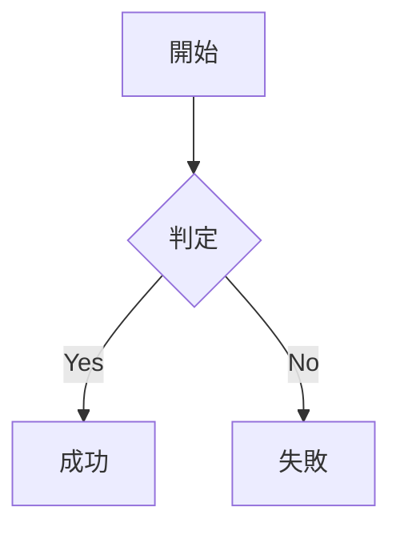

# マークダウン入門サンプルファイル
## AIもエンジニアも使う記法を12個押さえよう

このファイルをVS Codeで開いて `Ctrl+Shift+V` を押すとプレビューできます。

---

## ① 見出し（Heading）

# h1 見出し（大見出し）
## h2 見出し（中見出し）
### h3 見出し（小見出し）
#### h4 見出し

> ポイント：`#` のあとには半角スペース1つ必須。h1 はドキュメントに1つだけにすると構造が整う。

---

## ② 太字・斜体（Emphasis）

**これは太字（ボールド）です**

*これは斜体（イタリック）です*

***これは太字かつ斜体です***

> ポイント：日本語では斜体が見分けにくい。日本語メインなら太字を中心に。強調は1段落1〜2箇所が目安。

---

## ③ 箇条書きリスト（Unordered List）

- りんご
- みかん
  - 温州みかん
  - デコポン
- ぶどう

> ポイント：`-`・`*`・`+` のどれでも使えるが、チームで記号を統一しよう。ネストはスペース2つで。

---

## ④ 番号付きリスト（Ordered List）

1. 企画
2. 設計
3. 実装
4. テスト
5. リリース

> ポイント：全部 `1.` と書いても自動連番になる。途中挿入・並べ替えが楽になる小技。

---

## ⑤ インラインコード（Inline Code）

変数 `userName` に値を代入してください。

`git commit -m 'msg'` を実行します。

> ポイント：変数名・コマンド名・ファイル名が出たら迷わずバッククォートで囲む。可読性と信頼が上がる。

---

## ⑥ コードブロック（Code Block）

```javascript
const greet = (name) => {
  console.log(`Hello!`);
};
```

```python
def greet(name):
    print(f'Hello!')
```

> ポイント：バッククォート3つのあとに言語名を指定するとシンタックスハイライトが効く。`js` / `python` / `bash` / `sql` / `json` など豊富。

---

## ⑦ リンク（Link）

[Google](https://www.google.com)

[プロジェクトのREADME](./README.md)

> ポイント：覚え方は「角カッコ[]にテキスト → 丸カッコ()にURL」。表示テキストが先、URLがあと。

---

## ⑧ 画像（Image）


> ポイント：altテキストを省略しない。アクセシビリティ配慮と、画像が表示されない場合の説明になる。
> ※ リンク記法の先頭に `!` をつけるだけで画像になる。

---

## ⑨ 引用（Blockquote）

> これは引用文です。
> 仕様書の原文を貼るときに便利。
>
> 段落も分けられます。

>> 引用のネスト（入れ子）もできます。

> ポイント：PRで「元の仕様はこう書かれていました」と根拠を示すときに特に重宝。エビデンスで説得力UP。

---

## ⑩ テーブル（Table）

| 項目     | 説明               | 特徴・用途           |
| -------- | ------------------ | -------------------- |
| Markdown | 軽量マークアップ   | READMEに最適         |
| HTML     | Web用マークアップ  | Webサイト制作に使用  |
| LaTeX    | 組版システム       | 論文・数式に強い     |

> ポイント：テーブルの手書きは面倒。「Markdown Table Generator」などのWebツールで生成してから貼り付けるのが現場の定番。

---

## ⑪ 水平線（Horizontal Rule）

セクション区切りの前

---

次のセクション内容

> ポイント：`---` の前後には必ず空行を。見出しとの区別が曖昧になるケースを防げる。

---

## ⑫ チェックリスト（Task List）

- [ ] 未完了のタスク
- [x] 完了したタスク
- [ ] サブタスクもネストできる
  - [ ] 細かい作業1
  - [x] 細かい作業2

> ポイント：`- [ ]` の角カッコの中にスペースを入れるのを忘れずに。`[x]` で完了マークになる。GitHubでは実際にクリックで切り替え可能。

---

## 発展：Mermaid記法 ── テキストで図を描く

Mermaidは**コードブロック内に図の構造をテキストで書くと、フローチャートなどが自動生成される拡張記法**です。

> **注意**：多くのツールではマークダウンはHTMLに変換されて表示されますが、Mermaidへの対応はツールによって異なります。使うツールが対応しているか確認してから使いましょう。

### フローチャートの例



### 記号の意味

| 記号 | 意味 |
| ----------- | -------------------- |
| `graph TD` | 上から下に流れる図 |
| `A[テキスト]` | 四角ノード |
| `B{テキスト}` | ひし形ノード（分岐） |
| `-->` | 矢印（接続） |
| `-->|ラベル|` | ラベル付き矢印 |

### ✅ 対応しているツール

- GitHub（公式標準対応・追加設定不要）
- Notion / Zenn / GitLab
- VS Code（拡張機能を追加すれば対応）

### ❌ 対応していないツール（注意！）

- VS Code の標準プレビュー（拡張機能なし）
- Microsoft Teams
- Qiita
- 通常のMarkdownビューワー

### ⚠️ VS Codeで試す手順

1. `Ctrl+Shift+X` で拡張機能タブを開く
2. 検索欄に「**Mermaid**」と入力
3. 「**Markdown Preview Mermaid Support**」をインストール
4. `.md` ファイルのプレビューを再表示（`Ctrl+Shift+V`）
